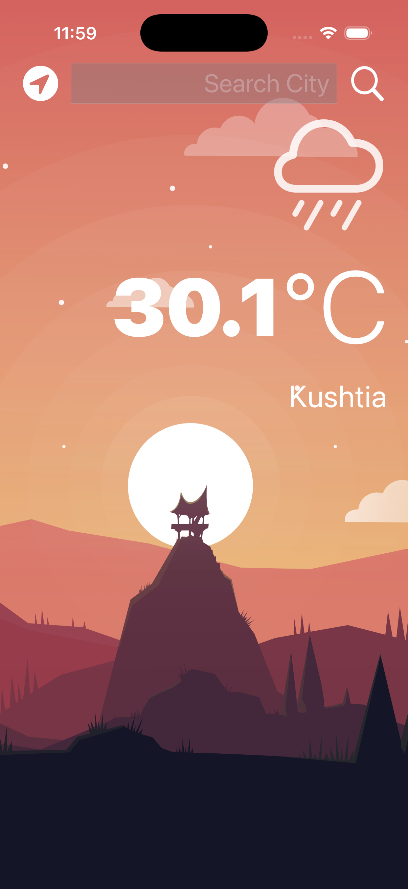

# Clima

Clima is a UIKit weather app that displays current weather conditions for the user's location or a manually searched city. It was built as part of Angela Yu's iOS course and focuses on networking, JSON decoding, Core Location, and delegate-based communication in a storyboard-driven iOS app.

## Screenshots

| Light Mode | Dark Mode |
| --- | --- |
|  |  |

## Features

* Fetches live weather data from the OpenWeatherMap API.
* Gets current-location weather using Core Location.
* Supports manual city search through a text field.
* Displays the city name and temperature in Celsius.
* Shows weather condition icons using SF Symbols.
* Supports light and dark mode visual assets.
* Uses delegate patterns for text input, location updates, and weather updates.

## Technical Overview

* `WeatherViewController` manages the main screen, user interactions, location requests, and UI updates.
* `WeatherManager` builds API requests, performs networking with `URLSession`, decodes JSON responses, and reports results through a delegate.
* `WeatherData` defines the Codable model for the OpenWeatherMap API response.
* `WeatherModel` prepares display-ready values, including formatted temperature and the matching SF Symbol name.

## Project Structure

```text
.
|-- Clima.xcodeproj
`-- Clima/
    |-- README.md
    |-- Documentation/
    |   |-- clima-screenshot-light-mode.png
    |   `-- clima-screenshot-dark-mode.png
    `-- Clima/
        |-- Controller/
        |-- Model/
        |-- View/
        `-- Assets.xcassets
```

## Getting Started

1. Open `Clima.xcodeproj` from the repository root in Xcode.
2. Add a valid OpenWeatherMap API key in `WeatherManger.swift`.
3. Build and run the app on a simulator or physical device.
4. Allow location access when prompted to use current-location weather.

## Concepts Practiced

* UIKit and storyboard-based interface building.
* `UITextFieldDelegate`.
* Custom Swift protocols and delegation.
* Core Location permission handling and GPS coordinate lookup.
* Networking with `URLSession`.
* JSON parsing with `Codable`.
* Main-thread UI updates after asynchronous work.
* Computed properties for display formatting.

